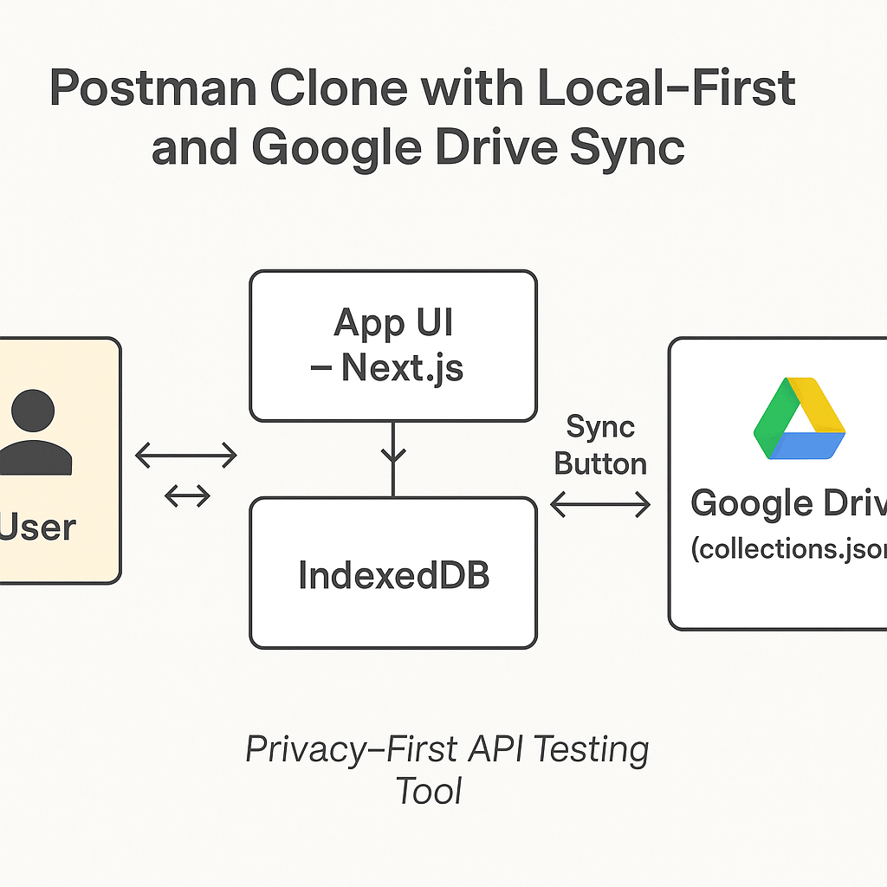

# 🔐 Postman Clone — Privacy-First API Testing Tool

A powerful, privacy-respecting Postman alternative built with **Next.js** and **Firebase Auth**, designed to give users **full control of their API data**.

> ⚡ Fast. 🔒 Private. ☁️ Cloud-Optional.

---

## ✨ Features

- 🧪 Build and test REST API requests (GET, POST, PUT, DELETE, etc.)
- 📂 Organize requests into **collections**
- 🧠 Save request history, headers, body, auth, and more
- 💾 **Local-first storage** using `IndexedDB` for instant, offline access
- ☁️ **Google Drive sync** — user data is backed up to their own Drive
- 🔐 Auth via **Firebase + Google OAuth**
- ✅ No server-side data storage — **100% user-owned data**

---

## 🔧 Tech Stack

- **Frontend**: Next.js (App Router)
- **Auth**: Firebase Authentication (Google)
- **Local Storage**: IndexedDB (via `idb` or `Dexie.js`)
- **Cloud Storage**: Google Drive REST API
- **UI**: Tailwind CSS

---

## 🔄 Architecture Overview

[User] ⇄ [App UI - Next.js]
⇅
[IndexedDB] ←→ [Sync Button] ←→ [Google Drive (collections.json)]

---



---

## 🛠 Setup Instructions

1. **Clone the repo**

   ```bash
   git clone https://github.com/your-username/postman-clone.git
   cd postman-clone
   npm install

   ```

2. **Set up Firebase**
   • Create a Firebase project
   • Enable Google Sign-In under Auth > Sign-in method
   • Get your config keys and paste into .env.local:

3. Enable Google Drive API
   • Go to Google Cloud Console
   • Enable Drive API
   • Create OAuth 2.0 Client ID (Web App)
   • Whitelist origin: http://localhost:3000

4. Run locally

   ```
   npm run dev

   ```

5. **🔄 Syncing to Google Drive**

   - Users sign in via Google

   - All API collections are stored locally (IndexedDB)

   - Clicking “Sync to Drive” uploads collections.json to a private Drive folder

   - Drive token is securely handled via Firebase Google auth

   - Only the user can access their files

6. **🧠 Privacy First Philosophy**

   - All data stays in the user’s browser or Google Drive

   - We store no backend data

   - Built for developers who care about data ownership and speed

---

## 🧠 Prompt: Postman Clone with Local + Google Drive Hybrid Sync

I’m building a privacy-first Postman-like API testing app using Next.js and Firebase Auth.

✅ The goal is to let users manage their API collections and requests without storing data on our servers. Instead, all data should remain under the user’s control.

Here’s the architecture vision:

🧩 Core Design

1. Local-First Storage:
   • User data (collections, environments, requests) is stored locally in the browser, using IndexedDB (preferred over localStorage for structured JSON).
   • This allows instant access, offline support, and zero network delay.

2. Cloud Sync with Google Drive:
   • Users can manually sync their data to their own Google Drive via OAuth.
   • Data is stored in the user’s Drive either:
   • As a single collections.json file, or
   • As separate files per collection inside a dedicated folder (optional).
   • The sync can be one-click, on interval, or triggered on changes.

3. Authentication:
   • We’re using Firebase Authentication with Google Sign-In to authenticate users.
   • Post-authentication, we extract the Google OAuth token to access the Drive API.

4. Sync Workflow:
   • On “Sync to Drive”, we:
   • Fetch user data from IndexedDB
   • Serialize it as JSON
   • Upload/update the file(s) using the Google Drive API
   • We also support a lastSyncedAt timestamp to prevent conflicts.

5. Privacy by Design:
   • The entire app avoids storing any user data on our own backend.
   • All data lives in the user’s browser and their Google Drive account.

6. Future Enhancements:
   • Let users configure automatic sync intervals
   • Add UI status indicators: ✅ Synced | 🔁 Syncing | ⚠️ Conflict
   • Version history using Drive’s built-in file revisions
   • Optional Google Sheets logging for sent request history

🎯 Overall Goal:

A secure, self-owned API tool that behaves like Postman, but stores everything in the user’s environment — fast, private, and serverless.

---
